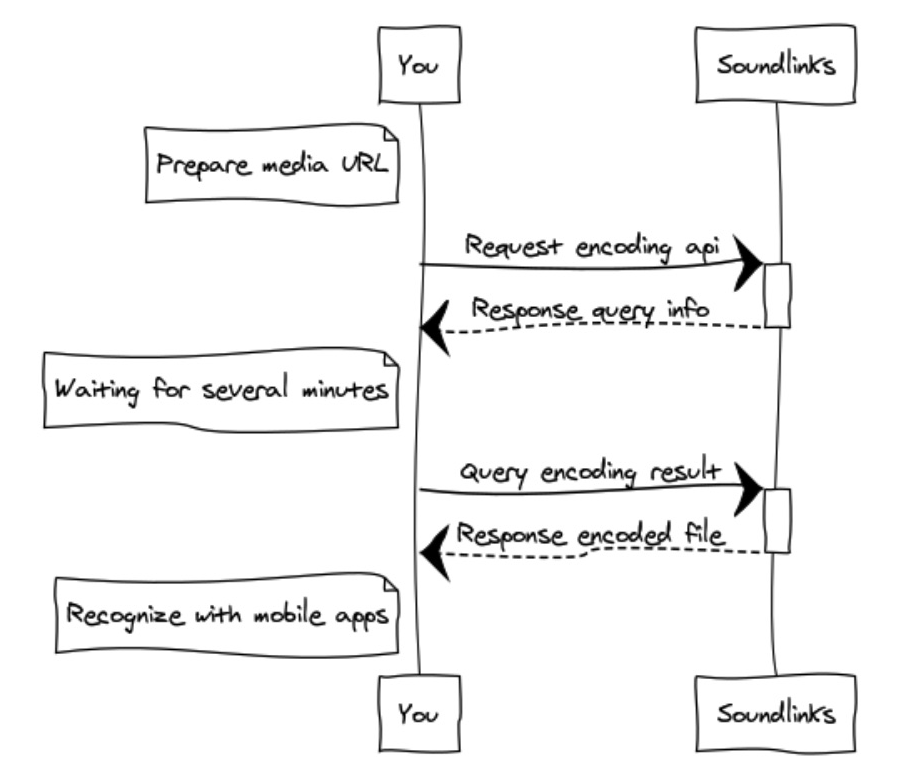

# API

## 介绍

我们的 API 遵循 RESTful 风格，通过 [JWT](https://jwt.io/) 进行验证，接受 JSON 编码的请求，返回 JSON 编码的结果，并使用标准的 HTTP 状态码。

基地址是：

```
https://api.soundlinks.net/v3
```

## 身份验证

在使用以下 API 时，除非在说明里指出“无需验证”，其它情况一律需要在 request header 里带上 `Authorization: Bearer {token}`。调用此 API 来获取 `token`，过期时间为 30 天。

```
POST /organization/token
```

#### 请求参数

| 字段 | 类型 | 备注 |
| ----- | ---- | ---- |
| appId | string | APP ID |
| appKey | string | APP Key |

### 返回

| 字段 | 类型 | 备注 |
| ----- | ---- | ---- |
| token | string | JWT token

## 编码音频

你可以使用编码服务来创建属于自己的带有 Soundlinks 的音频文件。流程如下图所示：



### 请求

该接口参数 `file` 仅接受音频文件的 URL，所以需要事先把待编码的音频上传到服务器。

```
POST /v3/sl/encoding
```

#### 请求参数

| 字段 | 类型 | 备注 |
| ----- | ---- | ---- |
| artist | string | 作者名字 |
| file | string | 音频 URL |
| title | string | 音频标题 |
| thumbnail | string | 音频封面 URL |

### 返回

| 字段 | 类型 | 备注 |
| ----- | ---- | ---- |
| error | string | 错误信息 |
| success | boolean | 成功标识 |
| code | string | Soundlinks ID |

## 查询编码结果

由于完成编码需要几分钟时间，你可以用返回的 `code` 去查询音频的编码结果。

### 请求

```
GET /sl/encoding/progress/{query}
```

#### 请求参数

| 字段 | 类型 | 备注 |
| ----- | ---- | ---- |
| query | string | Soundlinks ID |

### 返回

返回的编码状态有以下可能：

- null
- processing
- complete
- failed

| 字段 | 类型 | 备注 |
| ----- | ---- | ---- |
| status | string | 编码状态 |
| encodedFile | string | 编码后的音频 URL |
