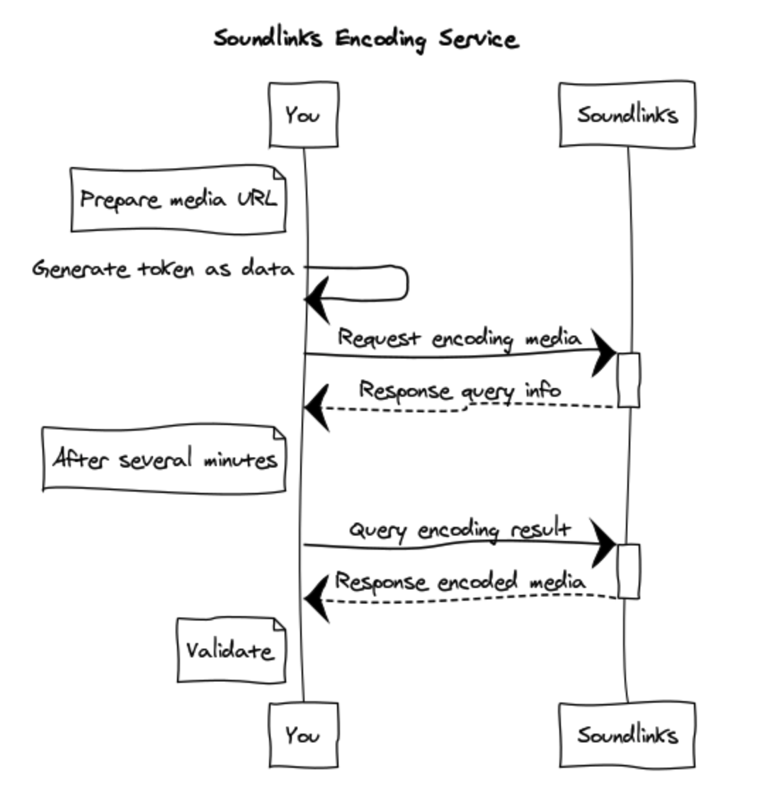

# 编码 API

你可以使用我们的编码服务来创建属于自己的带有 Soundlinks 的歌曲。流程如下图所示：



## 如何请求编码 API

请求 API 的参数将用 [JWT（JSON Web Tokens）](https://jwt.io/) 进行传输，以验证使用方的身份和参数的合法性。开发者可根据使用环境选择合适的库进行接下来的步骤。

以下生成 JWT 的方法以 Node.js 为例，其它语言和环境也是类似的。如果在生成 JWT 时遇到任何问题，请联系我们。

### 1. 准备 `APP_ID` 和 `APP_SECRET`

经过认证的开发者将分配到一组 `APP_ID` 和 `APP_SECRET`，请发送邮件至 [dev@soundlinks.net](mailto:dev@soundlinks.net) 申请。

### 2. 安装 JWT 库

以 [jsonwebtoken](https://github.com/auth0/node-jsonwebtoken) 为例：

```bash
$ npm install -S jsonwebtoken
```

### 3. 构成 JWT header

签名加密算法使用 HMAC SHA256，即通常的默认算法：

```json
{
    "alg": "HS256",
    "typ": "JWT"
}
```

### 4. 构成 JWT payload

必需的 JWT payload 包括：

- `iss`：即 `APP_ID`
- `iat`：请求当时的时间戳
- `mtd`：API 的请求方法，GET、POST、PUT 等等，请统一用大写
- `url`：API 的请求 URL
- `arg`：API 的请求参数

以**自动编码 API** 为例，生成完整 JWT 的代码如下：

```js
const jwt = require("jsonwebtoken");
const APP_ID = 'my_app_id';
const APP_SECRET = 'my_app_secret';

// Sign the payload
const token = jwt.sign({
    iss: APP_ID,
    iat: Math.floor(Date.now() / 1000),
    mtd: 'POST',
    url: '/v3/sl/encoding',
    arg: { src: 'https://example.com/song.mp3' },
}, APP_SECRET);
```

[在线 Demo](https://runkit.com/wyudong/jwt-demo)。

### 5. 开始请求

请求时，在 headers 里设置 `Content-Type:application/json`，然后将上一步生成的 `token` 作为 `data` 放在 body 里进行请求，即：

```json
{
    "data": <token>
}
```

## API - 开始自动编码（未开放）

### 请求

该接口仅接受歌曲链接，所以需要事先把待编码的歌曲上传到远端服务器。

```
POST /v3/sl/encoding
```

| 字段 | 类型 | 备注 |
| ----- | ---- | ---- |
| src | string | 歌曲链接 |
| artist | string | 作者名字 |

### 返回

| 字段 | 类型 | 备注 |
| ----- | ---- | ---- |
| query | string | 查询凭证 |

## API - 查询编码结果（未开放）

### 请求

```
POST /v3/sl/query
```

| 字段 | 类型 | 备注 |
| ----- | ---- | ---- |
| query | string | 查询凭证 |

### 返回

返回的编码状态有以下可能：

- processing
- complete
- failed

| 字段 | 类型 | 备注 |
| ----- | ---- | ---- |
| status | string | 编码状态 |
| message | string | 编码信息 |

## 验证 Soundlinks

请使用 [SOUNDLINKS APP](https://soundlinks.net/apps) 或者集成我们的 SDK 后进行验证。
