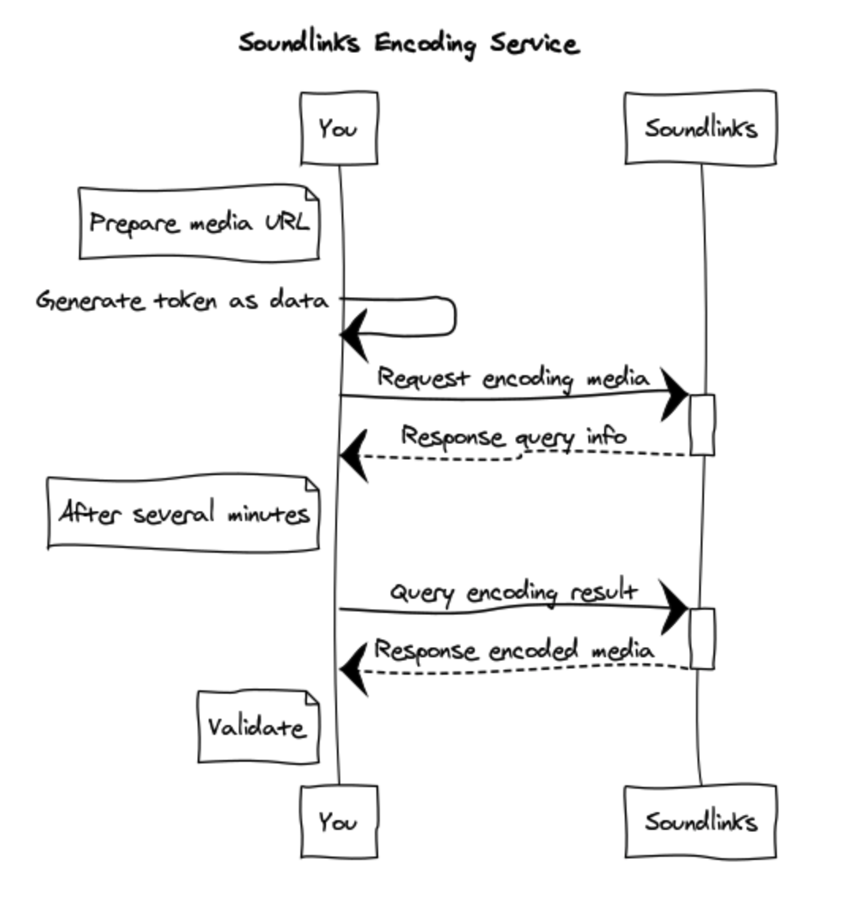

# 编码 API

你可以使用我们的编码服务来创建属于自己的带有 Soundlinks 的歌曲。流程如下图所示：



## API - 开始自动编码

### 请求

该接口仅接受歌曲链接，所以需要事先把待编码的歌曲上传到远端服务器。

```
POST /v3/sl/encoding
```

#### JWT payload 参数

| 字段 | 类型 | 备注 |
| ----- | ---- | ---- |
| src | string | 歌曲链接 |
| artist | string | 作者名字 |

#### 请求参数

| 字段 | 类型 | 备注 |
| ----- | ---- | ---- |
| data | string | 数据 token |

### 返回

| 字段 | 类型 | 备注 |
| ----- | ---- | ---- |
| query | string | 查询凭证 |

## API - 查询编码结果

### 请求

```
POST /v3/sl/query
```

#### JWT payload 参数

| 字段 | 类型 | 备注 |
| ----- | ---- | ---- |
| query | string | 查询凭证 |

#### 请求参数

| 字段 | 类型 | 备注 |
| ----- | ---- | ---- |
| data | string | 数据 token |

### 返回

返回的编码状态有以下可能：

- processing
- complete
- failed

| 字段 | 类型 | 备注 |
| ----- | ---- | ---- |
| status | string | 编码状态 |
| message | string | 编码信息 |

## 验证 Soundlinks

请使用 [SOUNDLINKS APP](https://soundlinks.net/apps) 或者集成我们的 SDK 后进行验证。
